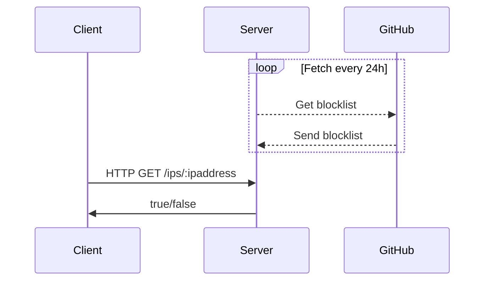
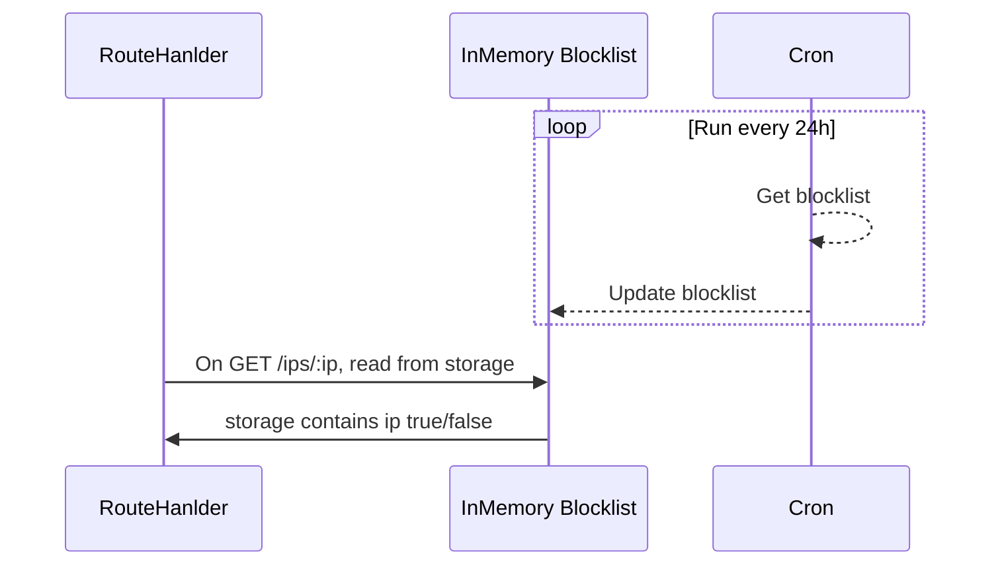

# Design choices

The goal is to have one open HTTP endpoint which can be given an IP address, and based on that, returns `true` or `false` if 
given address is on a blocklist or not. The given blocklist is residing under the following URL: https://raw.githubusercontent.com/stamparm/ipsum/master/ipsum.txt and is 
getting updated every 24h.

## Choices

Based on the requirements, certain choices have to made. Both from a tooling standpoint (Programming Language, external packages), from an architecture point of view (storage, splitting code in different modules) and a functional point of view (how to check periodically for updates, how to look up the IP address in the fastest way etc.).

### Language and tooling

1. Programming language
* Choice: Rust
* Reason: Familiarity, and based on the skills I want to demonstrate and practice.

2. Packages/Frameworks
* Choices: Axum, tokio, reqwest, regex
* Reason: 
  * axum: A modern and fast web framework, built on top of the well-known tokio stack like tower and hyper.
  * tokio: The de-facto standard runtime to run asynchronous Rust code.
  * reqwest: To query the blacklist endpoint in an asynchronous fashion.
  * regex: To parse the receiving blacklist and extract all IP addresses. 

## Architecture

The high level overview consists of 3 parties. A client, a server and GitHub where the blocklist is stored.

The server opens up locally on port `3000` (`127.0.0.1:3000`) and is able to receive and send out HTTP messages. It also runs a task/deamon running every 24h which fetches the latest blocklist. 

A GET request with the IP as a paramter can be send on the the following path: `/ips`. The server will answer with either `true` oder `false` if the give ID is on this blocklist or not.

Inside the application, we have a server which passes incoming requests to a `RouteHandler`, an `InMemory` storage (`Vec<String>`), and a `Cron` job which fetches the `blocklist` and updates the in-memory storage periodically.

The in-memory storage is sorted, so we can do a binary search for looking up a given IP address. This results in faster lookup times.

### Fulfilment of requirements:
* Created a web server which can receive and response with proper formatted HTTP requests.
* A path on `/ips/:ip` is open to receive `HTTP GET` requests.
* A response is being sent if the IP address is part of the blocklist with `true` or `false` inside a proper formatted HTTP response. 
* The web server `axum` is built on top of the HTTP server `hyper`, which can handle roughly 75k requests per second.
* The choice to run fetching the latest blocklist on a sperate thread enables a zero-downtime updating of the in-memory storage.
* Updating the in-memory storage is done **AFTER** the blocklist is already fetched and sorted, resulting in no long blocking or downtime.
* The in-memory storage is ordered and searched through via binary search, which results in fast response times.